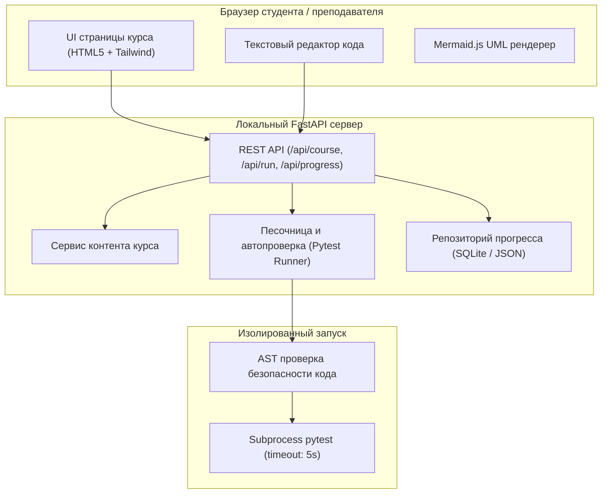

# Архитектура веб-платформы Web OOP (Мини-LMS)

## 1. Обзор системы и цели

Веб-платформа **Web OOP** — это локальная образовательная среда (мини-LMS) для интерактивного изучения ООП студентами второго курса КазНУ.
Система позволяет:
- Изучать структурированные материалы курса (3 недели: Основы ООП → SOLID → Паттерны GoF).
- Исследовать интерактивные UML-диаграммы классов и жизненного цикла объектов.
- Проходить тесты на понимание концепций и ловушек ООП.
- Писать и проверять код решений прямо в браузере с мгновенным локальным запуском автотестов (`pytest`).
- Накапливать баллы за пройденные модули и финальный экзамен.

## 2. Технологический стек

Выбор стека ориентирован на максимальное удобство и прозрачность для ИИ-агентов (AI-legibility) и простоту локального запуска:
- **Бэкенд:** Python 3.12+ / FastAPI / Uvicorn
  - Строгая типизация через Pydantic.
  - Встроенная спецификация OpenAPI / Swagger (`http://localhost:8000/docs`).
  - Чистая компонентная архитектура без лишней магии.
- **Фронтенд:** Нативный HTML5 + Tailwind CSS (CDN) + Vanilla JS (ES-модули) + Mermaid.js
  - **Zero build step:** Нет `node_modules`, `webpack`, `vite`, `npm install` — фронтенд готов к работе мгновенно.
  - **Динамический рендеринг диаграмм:** Mermaid.js рендерит диаграммы классов и последовательностей прямо в браузере.
- **Тестирование и линтинг:**
  - `pytest` — запуск как тестов платформы, так и студенческих заданий.
  - `ruff` — сверхбыстрый статический анализ и проверка стиля кода.
- **Хранилище данных:**
  - Локальный файл `data/state.json` или SQLite — персистентность прогресса студентов и баллов без внешних СУБД.

## 3. Схема архитектуры



## 4. Безопасность локальной проверки кода

1. **AST-валидация:** код студента перед запуском парсится модулем `ast`. Запрещены импорты опасных модулей (`subprocess`, `shutil`, `socket`) и деструктивные операции.
2. **Изолированный subprocess:** тесты запускаются в отдельном процессе с ограничением времени выполнения (`timeout=5`). Бесконечные циклы студента прерываются автоматически без падения веб-сервера.
3. **Структурированный ответ:** бэкенд возвращает статус `passed/failed`, список тестов, лог вывода и начисленные баллы.

## 5. Запуск платформы

```bash
# Установка зависимостей (при наличии uv или pip)
uv pip install fastapi uvicorn pydantic pytest ruff

# Запуск сервера
python -m uvicorn app.main:app --reload --port 8000
```
Сайт доступен локально: `http://localhost:8000`.
