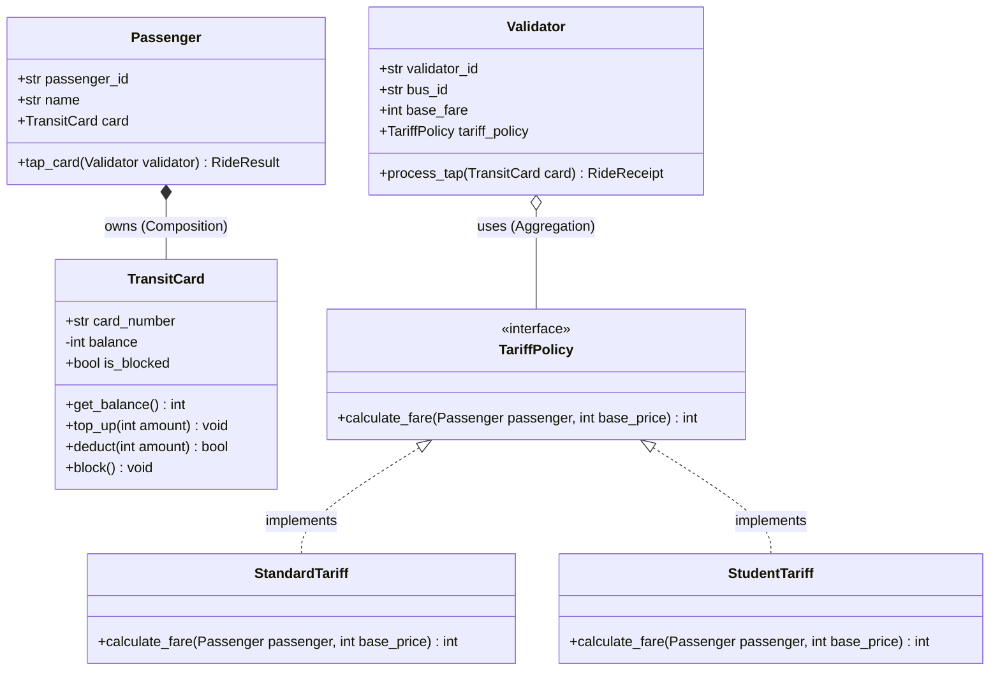
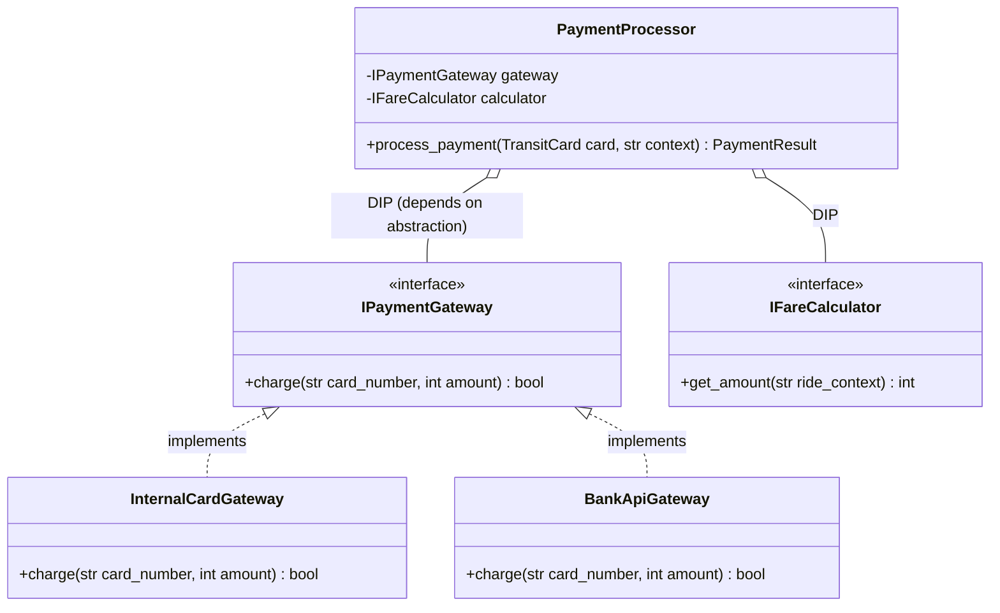
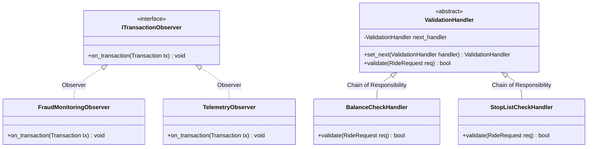

# Модель предметной области Avtobys (UML Диаграммы)

Настоящий документ содержит спецификацию ключевых сущностей, отношений и паттернов сквозного кейса **Avtobys**, используемого в курсе ООП.

## 1. Диаграмма классов: Неделя 1 (Базовая объектная модель)

## 2. Диаграмма классов: Неделя 2 (Принципы SOLID и DI)

## 3. Диаграмма классов: Неделя 3 (Паттерны проектирования GoF)

