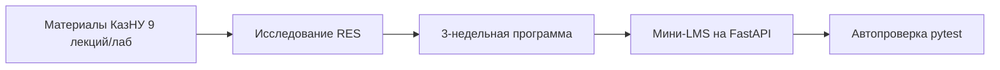

# RF — OOP_20261009-114007_INIT: Инициализация проекта и спецификация курса ООП

> **Current filename**: `workspace/2026/OOP_20261009-114007_INIT/RF__OOP_20261009-114007_INIT.md`  
> **Date**: 2026-10-09  
> **Author**: antigravity:coordinator  
> **Status**: 🟢 RF — Complete  
> **Parent HL**: [.tfw/workflows/init.md](../../../.tfw/workflows/init.md)  
> **TS**: [.tfw/workflows/init.md](../../../.tfw/workflows/init.md)  
> **Producer unit**: antigravity:coordinator  
> **Parent Coordinator**: antigravity:session:coordinator  
> **Activation / dispatch source**: owner-direct activation  
> **Coordination authority**: .tfw/workflows/init.md  
> **Originating proposer**: saubakirov  
> **Current selection**: baseline  

---

## 1. What Was Done

В рамках инициализации проекта TFW Full и выполнения вводной исследовательской задачи `OOP_20261009-114007_INIT` выполнено:
1. **Развертывание фреймворка TFW Full (v3.9.0):** скопировано ядро фреймворка в `.tfw/`, настроен `.tfw/project_config.yaml` с префиксом `OOP`, русским языком контента и командами верификации (`ruff check .` / `pytest`).
2. **Профиль участника и база знаний:** создан профиль преподавателя `team/saubakirov.md`, создана чистая база знаний `KNOWLEDGE.md`, корневой `README.md` с Project North Star (NS1, NS2, NS3) и direct routes.
3. **Адаптер Antigravity:** установлены правила `.agents/rules/tfw.md` и все 11 навыков фреймворка в `.agents/skills/`, сформирован `AGENTS.md`.
4. **Исследование учебных материалов КазНУ (`research/iter1/RES.md`):**
   - Проанализированы 9 лекций и 9 лабораторных работ по курсу CS2203 на Python 3.12+ из `G:\My Drive\AgentSharedFolder\KazNU\OOP`.
   - Разработана сжатая 3-недельная программа курса со сквозным кейсом **Avtobys** с таймингом «1 час лекция, 1 час практика, 1 час ДЗ» в неделю и итоговым экзаменом на 100 баллов.
   - Обоснован и выбран технологический стек: Python FastAPI + HTML5/Tailwind CDN/Vanilla JS/Mermaid.js + pytest runner (Zero build step, полная прозрачность для ИИ-агентов).
5. **Создана архитектурная документация в `docs/`:**
   - `docs/architecture.md` — архитектурная спецификация платформы, уровни, безопасность запуска кода.
   - `docs/course_curriculum.md` — силлабус 3 недель с темами лекций, практик, ДЗ и экзамена.
   - `docs/domain_model_uml.md` — UML-диаграммы классов, интерфейсов и паттернов предметной области Avtobys.
6. **Настройка среды и автотестов:** создан `pyproject.toml`, исключающий внутренности `.tfw` из линтинга, написан дымовой тест `tests/test_smoke.py`.

### New Files

| File | Description |
|---|---|
| `.tfw/project_config.yaml` | Конфигурация TFW проекта (префикс OOP, ruff, pytest) |
| `team/saubakirov.md` | Профиль преподавателя (Санжар Аубакиров) |
| `KNOWLEDGE.md` | База знаний проекта с архитектурными решениями и фактами |
| `README.md` | Корневой Project North Star с навигацией |
| `AGENTS.md` | Инструкция для агентов с управляемым блоком TFW |
| `.agents/rules/tfw.md` | Правила Antigravity для TFW |
| `.agents/skills/*` | 11 канонических TFW навыков для Antigravity |
| `workspace/2026/OOP_20261009-114007_INIT/*` | Полный след инициализационной задачи (status, journal, research, RES, RF) |
| `docs/architecture.md` | Архитектура мини-LMS и описание стека |
| `docs/course_curriculum.md` | 3-недельная программа курса с баллами |
| `docs/domain_model_uml.md` | UML-диаграммы классов Avtobys в Mermaid |
| `pyproject.toml` | Конфигурация Python проекта, ruff и pytest |
| `tests/test_smoke.py` | Дымовой тест окружения |
| `.gitignore` | Игнорируемые файлы |

## 2. Key Decisions

1. **D1 (Стек):** Python FastAPI + Tailwind CDN + Vanilla JS + Mermaid.js. Исключает тяжелые frontend-сборщики (no `node_modules`), запускается локально одной командой и легко сопровождается ИИ-агентами.
2. **D2 (Домен):** Сквозная предметная область городского транспорта Avtobys из семестрового курса КазНУ.
3. **D3 (Тайминг курса):** 3 недели по 3 академических часа в неделю (1ч лекция, 1ч практика, 1ч ДЗ) + финальный экзамен (15 вопросов квиза + архитектурный квест).
4. **D4 (Безопасность автопроверки):** Валидация AST кода студента перед запуском + изолированный запуск pytest в subprocess с таймаутом 5 секунд.
5. **D5 (Документация):** Все ключевые диаграммы и архитектурные решения зафиксированы в `docs/` для прозрачности перед человеком.

## 3. Acceptance Criteria

- [x] Инициализация TFW Full выполнена в соответствии с `.tfw/quickstart.md` и `.tfw/workflows/init.md`.
- [x] Настроен адаптер среды Antigravity (`.agents/rules/`, `.agents/skills/`).
- [x] Исходные материалы курса КазНУ исследованы и зафиксированы в `research/iter1/RES.md`.
- [x] Спроектирована структура 3-недельного курса и задокументирована в `docs/`.
- [x] Команды верификации проекта настроены и возвращают успешный статус (0 ошибок).

## 4. Verification

- **Lint (`ruff check .`):** `All checks passed!` (0 errors).
- **Tests (`pytest`):** `1 passed in 0.02s` (100% success).

## 5. Evidence

- Файлы конфигурации и окружения валидны и открываемы.
- Исследовательский отчет: [`research/iter1/RES.md`](research/iter1/RES.md).
- Документация в `docs/`: [`architecture.md`](../../docs/architecture.md), [`course_curriculum.md`](../../docs/course_curriculum.md), [`domain_model_uml.md`](../../docs/domain_model_uml.md).

## 6. Observations (out-of-scope, not modified)
No observations.

## 7. Fact Candidates

| # | Категория | Кандидат в факт | Источник | Уверенность |
|---|---|---|---|---|
| FC1 | domain | Курс CS2203 базируется на кейсе Avtobys (9 лекций и 9 лаб на Python 3.12+). | Материалы КазНУ | ★★★ |
| FC2 | constraints | Проект мини-LMS работает строго локально без внешнего облачного деплоя. | Указание пользователя | ★★★ |

## 8. Strategic Insights (Execution)

| # | Инсайт | Категория | Источник |
|---|---|---|---|
| S1 | Превращение семестрового курса в мини-LMS со сквозным доменом позволяет студентам одновременно осваивать чистое ООП и современную практику взаимодействия с ИИ-агентами по TFW. | education | saubakirov |

## 9. Diagrams

### Material handover at this return
- **Producer unit:** `antigravity:coordinator`
- **Source / epoch:** `e:\projects\web-oop`
- **Inspected scope:** Полная инициализация проекта и исследование вводных данных.
- **Material findings:** Проект полностью настроен, архитектура специфицирована, тесты и линтинг зеленые.
- **Continuation:** Закрытие задачи `OOP_20261009-114007_INIT` переводом в `DONE`.

---
*RF — OOP_20261009-114007_INIT | 2026-10-09*
