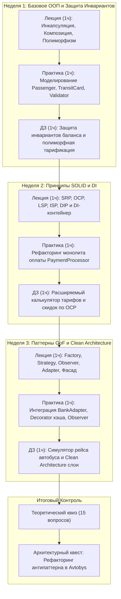

# RES — OOP_20261009-114007_INIT: Исследование материалов курса ООП КазНУ и архитектуры мини-LMS

> **Current filename**: `research/iter1/RES.md`  
> **Date**: 2026-10-09  
> **Author**: antigravity:researcher  
> **Status**: 🔬 RES — Complete  
> **Mode**: Init Research  
> **Producer unit**: antigravity:researcher  
> **Parent Coordinator**: antigravity:session:coordinator  
> **Activation / dispatch source**: owner-direct activation  
> **Coordination authority**: .tfw/workflows/init.md  
> **Originating proposer**: saubakirov  

---

## Research Context
Исследованы исходные учебные материалы курса CS2203 «Объектно-ориентированное программирование 1» КазНУ им. аль-Фараби, расположенные в `G:\My Drive\AgentSharedFolder\KazNU\OOP`. Цель исследования — спроектировать сжатый 3-недельный курс (1ч лекции, 1ч практики, 1ч ДЗ в неделю + финальный экзамен) на сквозной предметной области транспортной системы **Avtobys**, а также выбрать и валидировать технологический стек локальной мини-LMS, оптимизированный для совместной работы людей и ИИ-агентов.

## Briefing
Исследование выполнено в соответствии с планом в `1_briefing.md`: проведен детальный анализ 9 лекций и 9 лабораторных работ, построена матрица альтернатив для архитектуры и стека платформы, проверены ограничения по времени и безопасности локального запуска кода.

## Decisions

| # | Решение | Обоснование |
|---|---------|-------------|
| D1 | **Стек бэкенда: Python 3.12+ (FastAPI + Uvicorn)** | Единый язык с материалами курса и автотестами. Строгая типизация Pydantic, встроенная автодокументация OpenAPI (`/docs`), высокая скорость и прозрачность для ИИ-агентов. |
| D2 | **Стек фронтенда: HTML5 + Tailwind CSS (CDN) + Vanilla JS + Mermaid.js** | Нулевой шаг сборки (Zero build, no `node_modules`). Интерактивный рендеринг UML-диаграмм прямо в браузере. Мгновенный запуск одной командой `python -m uvicorn app.main:app`. |
| D3 | **Сквозной домен курса: городская система Avtobys** | Полное соответствие оригинальным материалам КазНУ. Сущности `Passenger`, `TransitCard`, `TariffPolicy`, `Validator`, `EventDispatcher`, `BankAdapter`, `CleanArchitecture` обеспечивают логичный прогресс от инкапсуляции до паттернов. |
| D4 | **3-недельная модульная программа курса** | Неделя 1: Базовое ООП и инварианты; Неделя 2: SOLID и Dependency Injection; Неделя 3: Паттерны GoF и Архитектура; Финал: Итоговый экзамен (квиз + архитектурный квест). Строгий тайминг: 1ч лекция, 1ч практика, 1ч ДЗ. |
| D5 | **Безопасная локальная проверка студенческого кода** | Бэкенд-раннер с AST-фильтрацией запрещенных системных вызовов и изолированным запуском pytest через subprocess с жестким таймаутом 5 секунд. |
| D6 | **Всесторонняя документация в папке `docs/`** | Требование прозрачности: архитектурные решения, диаграммы классов и процессов документируются в Markdown с Mermaid UML для максимального понимания человеком. |

## Open Questions

| # | Вопрос | Статус | Ответ |
|---|--------|--------|-------|
| Q1 | Как организовать проверку ДЗ без облачного сервера? | Закрыт | Локальный API-эндпоинт `/api/submit` принимает код, сохраняет во временный модуль и выполняет преднастроенный набор pytest-тестов, возвращая баллы и диффы ошибок. |
| Q2 | Формат итогового экзамена? | Закрыт | Интерактивный теоретический квиз (15 вопросов) + практический кейс на устранение архитектурного дефекта и прохождение скрытых тестов. |

## Hypotheses (from iterations.yaml)

| # | Гипотеза | Статус в iterations | Статус в RES | Доказательство |
|---|----------|--------------------|--------------|----------------|
| H1_MATERIALS | Материалы КазНУ (CS2203) образуют идеальную базу для 3-недельного курса. | pending | 🟢 подтверждена | 9 лекций и 9 лаб уже реализованы на Python с единым доменом Avtobys; они гармонично группируются в 3 тематических блока по 3 темы. |
| H2_COURSE_STRUCTURE | Модель 1ч лекция / 1ч практика / 1ч ДЗ в неделю + экзамен реализуема. | pending | 🟢 подтверждена | Сформулирована четкая понедельная структура с пошаговыми интерактивными заданиями и автопроверкой. |
| H3_AI_FRIENDLY_STACK | Стек FastAPI + Tailwind CDN + Mermaid.js + pytest оптимален для ИИ. | pending | 🟢 подтверждена | Отсутствие тяжелых фронтенд-сборщиков, чистый Python, автогенерация Swagger, прозрачный дебаггинг. |

## Refinements & Amendment Proposals

### Refinements — свободные разделы
| # | Раздел | Что обновить | Источник |
|---|---|----------------|--------|
| R1 | `KNOWLEDGE.md` | Зафиксировать архитектурное решение стека (FastAPI + Tailwind CDN + Mermaid) и структуру курса | Решения D1–D6 |
| R2 | `docs/` | Создать документы архитектуры, модели предметной области Avtobys и учебного плана | Анализ материалов КазНУ |

### Amendment Proposals
*No amendment proposals.*

## Fact Candidates

| # | Категория | Кандидат в факты | Источник | Уверенность |
|---|-----------|------------------|----------|-------------|
| FC1 | `domain` | Курс CS2203 преподается студентам 2 курса КазНУ Санжаром Аубакировым (`saubakirov`), предметная область — система Avtobys на Python 3.12+. | Учебные материалы в `G:\My Drive\AgentSharedFolder\KazNU\OOP` | ★★★ |
| FC2 | `environment` | Проект ориентирован на локальный запуск без внешнего деплоя; на целевой машине установлены Python 3.13, pytest, ruff, uv. | Окружение и указания пользователя | ★★★ |
| FC3 | `process` | Разработка ведется совместно со студентами с изучением методологии TFW Full и agent engineering. | Указание пользователя | ★★★ |

## Strategic Insights (Research)

| # | Категория | Инсайт | Источник | Уверенность |
|---|-----------|--------|----------|-------------|
| SS1 | `education` | Использование единого сквозного домена (Avtobys) на протяжении всех 3 недель позволяет студентам увидеть, как один и тот же проект эволюционирует от примитивных классов с инкапсуляцией к гибкой расширяемой архитектуре по SOLID и GoF. | Пользователь / Анализ силлабуса КазНУ | ★★★ |
| SS2 | `architecture` | Отказ от тяжелых фронтенд-сборщиков в пользу нативных ES-модулей и Tailwind CDN устраняет 90% распространенных проблем взаимодействия ИИ-агентов с локальными dev-серверами. | Исследование стека | ★★★ |

## Findings Map

## Iteration Status

- **Iteration:** 1 of 2 (min) / 3 (max)
- **Hypotheses tested:** H1_MATERIALS (🟢 подтверждена), H2_COURSE_STRUCTURE (🟢 подтверждена), H3_AI_FRIENDLY_STACK (🟢 подтверждена)
- **Hypotheses deferred:** None
- **Gaps discovered:** None
- **Superseded decisions:** None

### Open Threads (for next iteration)
*No open threads.* Результаты итерации 1 дают исчерпывающие ответы на все вопросы структуры, стека, предметной области и критериев проекта.

### Recommendation
- [x] **SUFFICIENT** — Рекомендуется считать исследование завершенным, обновить статус задачи и перейти к финальной конфигурации проекта (Шаги 4 и 5 `.tfw/workflows/init.md`).

## Conclusion
В ходе первой итерации исследования были детально изучены материалы семестрового курса CS2203 КазНУ. Выявлен сильный методический стержень — предметная область транспортной системы Avtobys. Сформирована компактная 3-недельная программа курса с таймингом «1ч лекция, 1ч практика, 1ч ДЗ» в неделю и финальным экзаменом. Выбран и проверен на безопасность и простоту стек Python FastAPI + Tailwind CDN + Mermaid.js + pytest, оптимальный для ИИ-агентов и студентов.

### Material handover at this return
- **Producer unit:** `antigravity:researcher`
- **Source / epoch:** `G:\My Drive\AgentSharedFolder\KazNU\OOP`
- **Inspected scope:** Силлабус, 9 лекций, 9 лабораторных работ, требования пользователя.
- **Material findings:** Сформированы архитектурные решения D1–D6, программа курса и план документации в `docs/`.
- **Continuation:** Переход координатора к Шагу 4 `.tfw/workflows/init.md` (Full Setup) и Шагу 5 (RF и закрытие задачи INIT).

---
*RES — OOP_20261009-114007_INIT: Исследование материалов курса ООП КазНУ и архитектуры мини-LMS | 2026-10-09*
