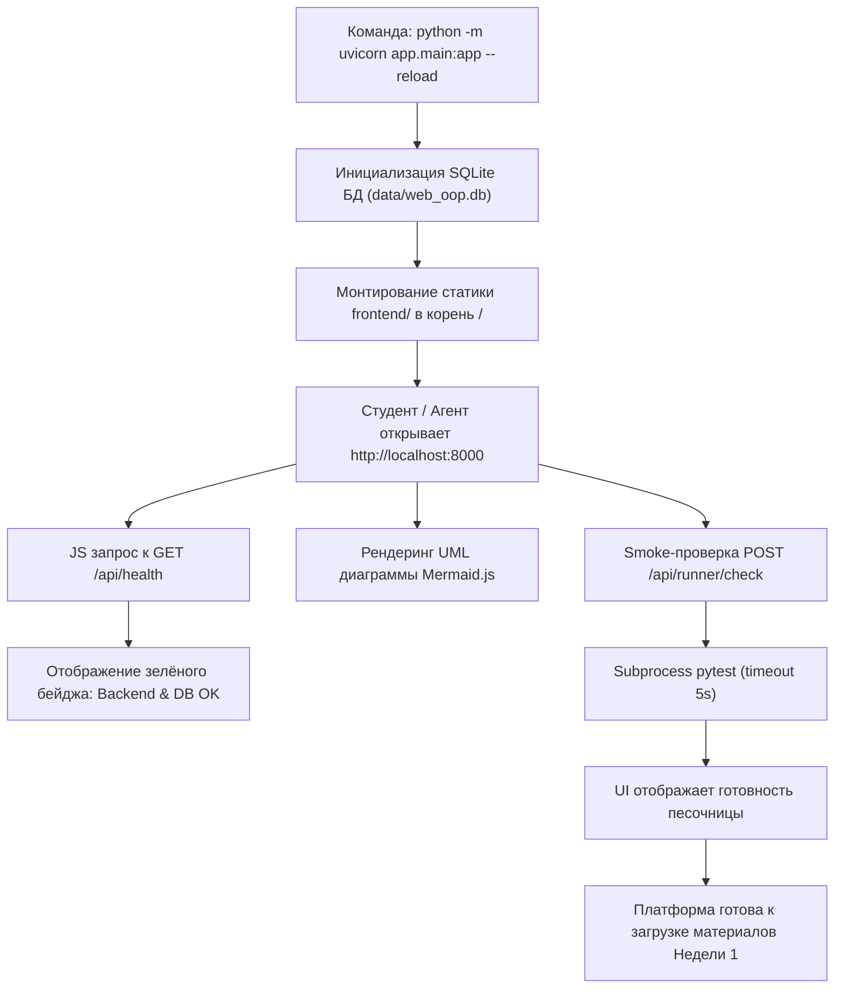

# HL — OOP_20261009-123309_PFBZ: Платформенный фундамент и базовый запуск платформы

> **Current filename**: `HL-OOP_20261009-123309_PFBZ.md`
> **Date**: 2026-10-09
> **Author**: saubakirov
> **Title**: Платформенный фундамент и базовый запуск платформы
> **Abbreviation**: PFBZ
> **Status**: 📝 HL_APPROVED
> **Contract**: 🔒 FROZEN — approved by saubakirov 2026-10-09
> **Frozen**: §1 · §3 · §4 · §5 · §6 · §7 — locked on owner approval
> **Free**: §2 · §7.2 · §8 · §9 · §10 · §11 — research updates these directly
> **Append-only**: §12 Amendment Log — the only channel for changing a frozen section
> **Baseline**: freeze commits — recovery form in `conventions.md` §3 rule 15
> **Project North Star**: `README.md #ns1 · #ns2 · #ns3`

---

## 1. Vision 🔒 FROZEN

Платформа Web OOP имеет надежный, чистый и полностью функционирующий технический фундамент: сервер FastAPI с типизированными эндпоинтами и автодокументацией, статическую раздачу нативного веб-интерфейса (HTML5 + Tailwind CDN + Vanilla JS + Mermaid.js), подключение к локальной базе данных SQLite через SQLAlchemy 2.0 и базовый изолированный сервис проверки кода RunnerService. Вся инфраструктура стартует одной командой, работает автономно на локальной машине без внешних сервисов и сборщиков и готова к непосредственному наполнению учебными материалами курса Недели 1.

**Impact:** Устранен технический риск старта: архитектурный каркас, контракты взаимодействия и изоляция кода проверены на реальном запуске, позволяя сфокусироваться в следующей задаче исключительно на методическом контенте и задачах Недели 1.

> *«Проект стартует моментально без единой установки npm-пакетов. Браузер сразу открывает работающий интерфейс, бэкенд и база данных на связи, а тесты проходят за секунду. Теперь мы можем спокойно добавлять учебные модули Недели 1 на готовую платформу».*

---

## 2. Current State (As-Is) 🟢 FREE

1. **Репозиторий и артефакты:**
   - Проект успешно инициализирован в рамках задачи `OOP_20261009-114007_INIT`.
   - Подготовлена документация в `docs/`: `architecture.md`, `course_curriculum.md`, `domain_model_uml.md`.
   - В корне определен `pyproject.toml` с зависимостями `fastapi`, `uvicorn`, `pydantic`.
   - В каталоге `tests/` присутствует только базовый проверочный `test_smoke.py`.
2. **Отсутствующие элементы:**
   - Нет точки входа бэкенда (`app/main.py`), нет структуры слоев API, сервисов и моделей.
   - Нет слоя хранения данных и схемы БД SQLite.
   - Нет файлов фронтенда и статической раздачи страниц.
   - Нет изолированного раннера `RunnerService` для выполнения тестовых сценариев студентов.

---

## 3. Target State (To-Be) 🔒 FROZEN

Создать минимальный, полностью работоспособный контур веб-платформы со следующими компонентами:

1. **Бэкенд (FastAPI):**
   - Структура пакета `app/`:
     - `app/main.py`: создание экземпляра FastAPI, настройка CORS (если требуется), монтирование раздачи статики, регистрация роутеров, lifecycle-события (инициализация БД).
     - `app/core/config.py`: настройки приложения через Pydantic Settings / легкий Config (пути к данным, порт, таймаут раннера).
     - `app/api/health.py`: эндпоинт `GET /api/health` со статусом сервиса, версии и БД.
     - `app/api/course.py`: базовый эндпоинт `GET /api/course/overview` (каркас структуры недель курса для отображения в навигации).
     - `app/api/runner.py`: базовый эндпоинт `POST /api/runner/check` для проверки передачи и исполнения кода.
2. **Хранилище данных (SQLite + SQLAlchemy 2.0):**
   - Файл БД `data/web_oop.db` (каталог `data/` добавлен в `.gitignore` или автосоздается при старте).
   - `app/db/session.py`: движок `create_engine("sqlite:///...")`, фабрика сессий, базовый класс декларативных моделей.
   - `app/models/`: базовые модели под структуру курса:
     - `Student`: профиль студента (`id`, `username`, `full_name`, `created_at`).
     - `TopicProgress`: прогресс по модулям (`id`, `student_id`, `week_number`, `topic_id`, `status`, `score`).
     - `Submission`: попытка сдачи кода (`id`, `student_id`, `task_id`, `code`, `status`, `passed`, `output`, `created_at`).
   - Функция автоматического создания таблиц `init_db()` при запуске приложения.
3. **Фронтенд (Zero-Build Web UI):**
   - Каталог `frontend/`:
     - `index.html`: адаптивная верстка на базе семантического HTML5 и Tailwind CSS (через CDN `https://cdn.tailwindcss.com`). Шапка с логотипом КазНУ и навигацией, панель системного статуса (Бэкенд, БД, Раннер), контейнер учебных модулей (заглушки Недель 1-3), область демо-диаграммы Mermaid.js.
     - `js/api.js`: модульный клиент для взаимодействия с бэкендом (`/api/health`, `/api/course/overview`, `/api/runner/check`).
     - `js/app.js`: точка входа фронтенда, опрос статуса бэкенда, рендеринг демо-диаграммы через нативный Mermaid.js CDN.
     - `css/styles.css`: минимальные кастомные стили (при необходимости).
4. **Песочница кода (RunnerService):**
   - `app/services/runner.py`:
     - Валидация синтаксиса через модуль `ast` (проверка отсутствия синтаксических ошибок и базовый запрет деструктивных вызовов).
     - Запуск процесса `pytest` во временной изолированной директории в `subprocess.run` с таймаутом `timeout=5`.
     - Корректный парсинг вывода (код возврата, stdout, stderr, статус passed/failed).
5. **Автотесты и проверка:**
   - Набор тестов `tests/test_api_health.py`, `tests/test_db_models.py`, `tests/test_runner_service.py`.
   - Полное прохождение `pytest` и отсутствие ошибок линтера `ruff check .`.

### 3.1 Result Visualization

```text
Браузер студента/преподавателя: http://localhost:8000/
┌────────────────────────────────────────────────────────────────────────────────┐
│ 🎓 Web OOP — КазНУ CS2203           [Неделя 1] [Неделя 2] [Неделя 3]   [API]   │
├────────────────────────────────────────────────────────────────────────────────┤
│ 🟢 Статус платформы: Сервер активен | SQLite: Connected | Runner: Ready        │
├────────────────────────────────────────────────────────────────────────────────┤
│ ┌───────────────────────────────────────┐ ┌──────────────────────────────────┐ │
│ │ 📖 Модули курса (Каркас)              │ │ 📊 Интерактивная UML-диаграмма   │ │
│ │                                       │ │    (Mermaid.js CDN)              │ │
│ │ • Неделя 1: Основы ООП & Инкапсуляция │ │ ┌──────────────────────────────┐ │ │
│ │   [Каркас готов к наполнению]         │ │ │ class Passenger {            │ │ │
│ │ • Неделя 2: Наследование & SOLID      │ │ │   +name: str                 │ │ │
│ │   [В разработке]                      │ │ │   +balance: float            │ │ │
│ │ • Неделя 3: Паттерны GoF & Архитектура│ │ │   +pay(amount): bool         │ │ │
│ │   [В разработке]                      │ │ │ }                            │ │ │
│ └───────────────────────────────────────┘ │ └──────────────────────────────┘ │ │
│                                           └──────────────────────────────────┘ │
│ ┌────────────────────────────────────────────────────────────────────────────┐ │
│ │ 🧪 Проверка песочницы: Smoke-тест RunnerService выполнен успешно за 0.18s  │ │
│ └────────────────────────────────────────────────────────────────────────────┘ │
└────────────────────────────────────────────────────────────────────────────────┘
```

### 3.2 Value Flow



---

## 4. Phases 🔒 FROZEN

Задача является компактной, архитектурно неделимой инфраструктурной базой и выполняется как **единая фаза (Single-phase task)**.

- **Phase A (Single-phase):** Реализация фундамента (FastAPI приложение, модели SQLite, статический фронтенд, RunnerService, тестовое покрытие).
  - **Приоритет:** 🔴 High
  - **Deliverables:**
    1. Пакет `app/` (`main.py`, `core/`, `api/`, `db/`, `models/`, `services/`).
    2. База данных SQLite с автосозданием таблиц `Student`, `TopicProgress`, `Submission`.
    3. Каталог `frontend/` (`index.html`, `js/api.js`, `js/app.js`, стили).
    4. Сервис `app/services/runner.py` с проверкой AST и таймаутом subprocess.
    5. Тесты в `tests/` с 100% успехом pytest и чистым ruff.

### 4.1 Coordination Selection 🔒 FROZEN

| Источник активации | Ответственный владелец | Координатор задачи | Правило координатора фазы | Охват ролей / мандат | Upward route | Диалог | Репортинг | Ограничения и резервирования | Полномочия правок | Неизменяемая эпоха |
|---|---|---|---|---|---|---|---|---|---|---|
| `owner-direct` | `saubakirov` | `antigravity:session:coordinator` | `none` (однофазная задача) | task Coordinator: HL/TS; Executor: handoff; Reviewer: review | `owner:saubakirov` | `tfw-gates-only` | `native-gates` | Владелец утверждает HL, TS, ключевые изменения скоупа и итоговое закрытие | `none` | baseline |

*Примечание к координации:* Выбран **Режим А (Visible full-chat route)**: для ролей Исполнителя (`/tfw-handoff`) и Ревьюера (`/tfw-review`) владелец открывает отдельные чаты с точной командой активации. Роли возвращают отчеты координатору вертикально через артефакты и `status.md`.

---

## 5. Definition of Done (DoD) 🔒 FROZEN

- ✅ 1. Создан и настроен пакет `app/` с чистой структурой слоев и точкой входа FastAPI `app/main.py`.
- ✅ 2. Реализован эндпоинт `GET /api/health`, возвращающий статус приложения и подтверждающий доступность SQLite.
- ✅ 3. Настроен слой БД SQLAlchemy 2.0 с декларативными моделями `Student`, `TopicProgress`, `Submission` и автосозданием схемы в `data/web_oop.db`.
- ✅ 4. Создан фронтенд в `frontend/` (HTML5, Tailwind CDN, ES-модули JS, Mermaid.js), отдающийся через FastAPI StaticFiles на корневом маршруте `/`.
- ✅ 5. Реализован базовый сервис `RunnerService`, способный безопасно исполнять проверочный тест через `subprocess pytest` с таймаутом 5 секунд.
- ✅ 6. Написаны интеграционные тесты для API, БД и RunnerService; все тесты в `pytest` проходят успешно.
- ✅ 7. Код соответствует стандартам проекта, проходит проверку `ruff check .` без замечаний.
- ✅ 8. Платформа запускается локально командой `python -m uvicorn app.main:app --reload` и отображает корректный UI в браузере.

---

## 6. Definition of Failure (DoF) 🔒 FROZEN

- ❌ 1. Появление внешних зависимостей сборки (Node.js, npm, webpack, vite) для фронтенда (нарушение NS2/D1).
- ❌ 2. Падение сервера или зависание процесса при выполнении скриптов в `RunnerService` (отсутствие таймаута или изоляции).
- ❌ 3. Невозможность локального старта приложения из-за жесткой привязки к внешним сервисам или сетевым базам данных.
- ❌ 4. Нарушение чистой архитектуры: перемешивание логики БД, HTTP-обработчиков и фронтенда в едином монолитном файле.
- ❌ 5. Наличие плейсхолдеров или незавершенных заглушек в критических путях (запуск, healthcheck, подключение к БД).

**On failure:** Немедленная остановка, откат регрессионных изменений до базового коммита, исправление архитектурного нарушения в TS.

---

## 7. Principles 🔒 FROZEN

1. **Zero Build Frontend** — Фронтенд работает напрямую в браузере без компиляции (HTML5 + Tailwind CDN + Vanilla JS + Mermaid.js CDN).
2. **Strict Typing & AI Legibility** — Все структуры данных, входные и выходные параметры типизированы через Pydantic v2 и Python type hints.
3. **Local-First Autonomy** — Никаких внешних облачных баз или API. Все данные живут в локальной SQLite БД.
4. **Resilient Subprocess Execution** — Песочница исполнения кода строго изолирована, ограничена по времени (5 секунд) и устойчива к исключениям.

### 7.1 Quality Contract 🔒 FROZEN

- Все новые файлы должны соответствовать проверкам `ruff check .`.
- Никаких фиктивных заглушек (`pass`, `TODO`) в продакшен-коде.
- Все функции снабжены понятными docstring с описанием контракта.

### 7.2 Knowledge Citations 🟢 FREE

| # | Источник | Элемент | Применение к задаче |
|---|---|---|---|
| 1 | `README.md` | `NS1` | Фокус на компактном веб-курсе для студентов 2 курса КазНУ |
| 2 | `README.md` | `NS2` | Стек, дружественный к ИИ-агентам, самодокументируемость и автономность |
| 3 | `README.md` | `NS3` | Non-goals: отказ от тяжелых фреймворков и микросервисов |
| 4 | `.tfw/README.md` | Methodology Values | Следование дисциплине артефактов и прозрачности следов TFW Full |
| 5 | `KNOWLEDGE.md` §1 | `D1 (Стек)` | FastAPI + Uvicorn + Tailwind CDN + Vanilla JS + Mermaid.js + SQLite |
| 6 | `docs/architecture.md` | §3-4 Архитектура | Реализация структуры слоев API, сервисов, БД и RunnerService |
| 7 | `conventions.md` | Scope Budgets & Roles | Соблюдение лимитов изменений и чистоты ролевых артефактов |

---

## 8. Dependencies 🟢 FREE

| Зависимость | Статус |
|---|---|
| Python 3.12+ / 3.13 с установленным `uv` и виртуальным окружением | ✅ Доступно в системе |
| Зависимости `fastapi`, `uvicorn`, `pydantic`, `pytest`, `ruff` в окружении | ✅ Установлены |
| Пакет `sqlalchemy` для декларативных моделей БД | ⬜ Требуется добавить в `pyproject.toml` |

---

## 9. Risks 🟢 FREE

| Риск | Вероятность | Влияние | Митигация |
|---|---|---|---|
| Запуск `subprocess pytest` на платформе Windows может вести себя иначе с путями и переменными среды | Medium | High | Реализация RunnerService с явным указанием `sys.executable`, абсолютных путей и обработкой `subprocess.TimeoutExpired` |
| Отсутствие интернета на машине пользователя при использовании CDN для Tailwind/Mermaid | Low | Medium | Базовые CSS-стили каркаса заложены в `frontend/css/styles.css` как fallback |
| Конфликты блокировок SQLite при параллельных запросах | Low | Low | Использование режима WAL или стандартного таймаута соединения в SQLite |

---

## 10. RESEARCH Case 🟢 FREE

### Blind Spots
- Специфика запуска `pytest` как subprocess в Windows (необходимость передачи правильного `sys.executable` и флагов).

### Hypotheses

| # | Гипотеза | Статус |
|---|---|---|
| H1 | FastAPI `StaticFiles(directory="frontend", html=True)` корректно обслуживает SPA-корень и статику без конфликтов с префиксом `/api` | open |
| H2 | Изолированный вызов `subprocess.run([sys.executable, "-m", "pytest", ...], timeout=5)` надежно прерывает бесконечные циклы на Windows | open |

*Обоснование пропуска фазы RESEARCH:*
Обе гипотезы опираются на стандартное документированное поведение Python и FastAPI, не несут стратегической архитектурной неопределенности и легко верифицируются стандартными автотестами Исполнителя на шаге `handoff`. Отдельное глубокое исследование не требуется; переход сразу к формированию спецификации `TS`.

### Why Not Just...?

| Подход | Ценность | Затраты и нагрузка | Риски и компромиссы | Решение |
|---|---|---|---|---|
| **Монолит FastAPI + StaticFiles + SQLite + Tailwind CDN** | Единый быстрый запуск, нулевой порог входа, прозрачность для ИИ | Минимальные затраты, единая кодовая база | Зависимость от CDN при первом открытии | **Выбрано** |
| **Раздельный бэкенд и фронтенд (двойной сервер)** | Изоляция процессов | Требует запуска двух терминалов, настройка CORS | Неудобство для студентов и преподавателя | **Отклонено** |
| **SPA на React/Vite + Docker** | Богатая компонентная экосистема | Огромный стек `node_modules`, сборка, Docker | Нарушение North Star NS2/NS3 | **Отклонено** |

**Leave unchanged:** Проект остается без работающего кода, создание курса заблокировано.

**Critical challenge:** Риск создать «мертвый каркас», оторванный от будущих потребностей Недели 1. Решение: сразу заложить в модели БД сущности `Student`, `TopicProgress`, `Submission`, а во фронтенде — компоновку под отображение недель и диаграмм Avtobys.

---

## 11. Strategic Insights (Planning) 🟢 FREE

| # | Инсайт | Категория | Источник |
|---|---|---|---|
| S1 | Владелец проекта четко сформулировал приоритет: сначала получить проверенный работающий фундамент (бэк, фронт, БД, раннер), а затем отдельной задачей встраивать контент Недели 1 | `strategy` | User, сообщение от 2026-10-09 |
| S2 | Выбран ручной режим координации (Mode A: visible full-chat route) с открытием отдельных чатов для ролей Исполнителя и Ревьюера | `process` | User, подтверждение от 2026-10-09 |

---

## 12. Amendment Log 🟢 APPEND-ONLY

**No amendments.**

### Material handover at this return

- **Producer:** Coordinator (`antigravity:session:coordinator`)
- **Epoch / Scope:** Inception task `OOP_20261009-123309_PFBZ`
- **Material effect:** Создан мастер-план HL для базового фундамента платформы.
- **Continuation:** Переход к согласованию HL и написанию Task Spec (TS).

---

*HL — OOP_20261009-123309_PFBZ: Платформенный фундамент и базовый запуск платформы | 2026-10-09*
