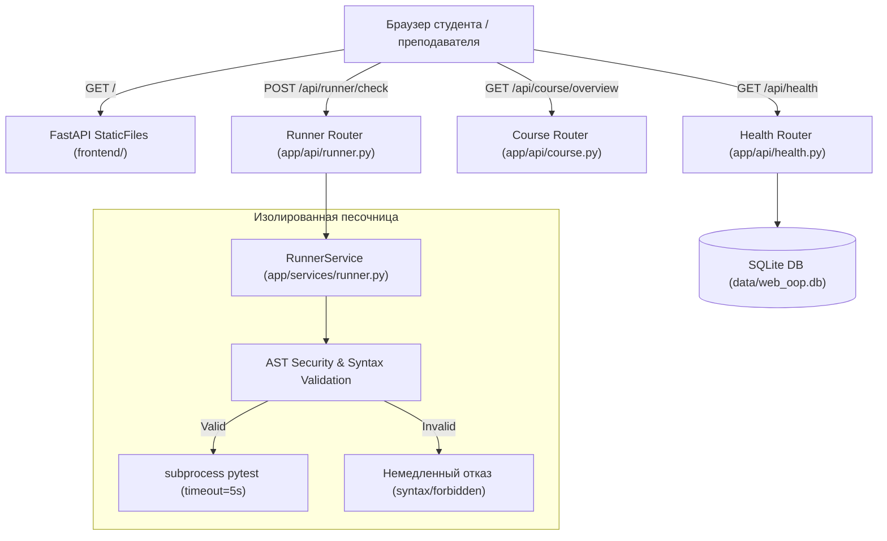

# RF — OOP_20261009-123309_PFBZ: Платформенный фундамент и базовый запуск платформы

> **Current filename**: `RF__OOP_20261009-123309_PFBZ.md`
> **Date**: 2026-10-09
> **Author**: saubakirov
> **Status**: 🟢 RF — Complete
> **Parent HL**: [HL-OOP_20261009-123309_PFBZ.md](HL-OOP_20261009-123309_PFBZ.md)
> **TS**: [TS__OOP_20261009-123309_PFBZ.md](TS__OOP_20261009-123309_PFBZ.md)
> **Producer unit**: antigravity:session:executor
> **Parent Coordinator**: antigravity:session:coordinator
> **Activation / dispatch source**: owner-direct: saubakirov
> **Coordination authority**: "HL-OOP_20261009-123309_PFBZ.md @ 900a1b0bebeeb3382bda9388321fa857b5360009"
> **Originating proposer**: none
> **Current selection**: reporting: native-gates, selection_ref: baseline
> **Launch observation**: model: Gemini 3.8 Flash (High), effort: default, material rework: none

---

## 1. What Was Done

В рамках реализации задачи `OOP_20261009-123309_PFBZ` полностью построен и верифицирован базовый технический контур платформы Web OOP:
1. **Бэкенд на FastAPI:**
   - Реализована точка входа `app/main.py` с lifespan-инициализацией БД и монтированием статики фронтенда на корневом маршруте `/`.
   - Создан модуль настроек `app/core/config.py` с путями и параметрами раннера.
   - Реализованы эндпоинты:
     - `GET /api/health` — проверка работоспособности сервиса, версии и активности базы данных SQLite.
     - `GET /api/course/overview` — получение структуры 3-недельного силлабуса курса CS2203 со статусами готовности модулей.
     - `POST /api/runner/check` — отправка пользовательского кода и тестового набора в изолированную песочницу.
2. **Слой хранения данных (SQLite + SQLAlchemy 2.0):**
   - Настроен движок `app/db/session.py` с автоматическим созданием директории `data/` и функции `init_db()`.
   - Объявлены декларативные модели SQLAlchemy 2.0 (`app/models/course.py`): `Student`, `TopicProgress`, `Submission` с типизированными полями `Mapped` и связями `relationship`.
3. **Zero-Build Веб-интерфейс (`frontend/`):**
   - `frontend/index.html` — адаптивная верстка со строкой статуса компонентов (Бэкенд, SQLite, Раннер), карточками недель курса, контейнером UML-диаграммы Mermaid.js и интерактивным блоком Smoke-проверки песочницы.
   - `frontend/js/api.js` — модульный клиент запросов к API.
   - `frontend/js/app.js` — инициализация состояния страницы, динамический опрос healthcheck, рендеринг диаграммы классов Avtobys (`Passenger` и `Validator`) и запуск smoke-теста раннера.
   - `frontend/css/styles.css` — автономные резервные стили на случай оффлайн-режима.
4. **Песочница безопасного исполнения кода (`RunnerService`):**
   - AST-анализатор безопасности `SecurityVisitor` перехватывает синтаксические ошибки и запрещает опасные модули (`subprocess`, `shutil`, `socket` и др.) и встроенные функции (`eval`, `exec`).
   - Изолированный запуск `pytest` во временной папке через `subprocess.run` с жестким таймаутом 5 секунд и перехватом `subprocess.TimeoutExpired`.
5. **Тестовое покрытие и валидация:**
   - Созданы тесты `tests/test_api_health.py`, `tests/test_db_models.py`, `tests/test_runner_service.py`.
   - Все 14 тестов проходят успешно (100% pass), статический анализ `ruff check .` завершается без единого предупреждения.

### Actual Value-Bearing Accounting

| Fact | Actual result |
|---|---|
| TS approval ref | `d03938a52451d589b6a12d4f3f3ee5e2e19b02af` |
| Baseline / Candidate | `900a1b0bebeeb3382bda9388321fa857b5360009` / `232328d965f9ef6fdab040252e516e5f755459d2` |
| VALUE membership | `pyproject.toml` (MODIFY), `app/**` (CREATE 14 files), `frontend/**` (CREATE 4 files) |
| Arithmetic | 1012 additions + 0 deletions = 1012 touched text LOC; 19 logical files; binary/non-text N/A: 0 |
| Membership deviations | none (соответствует плану из TS §4) |
| Trigger disposition | 19 файлов < 50; 1012 LOC < 5000 LOC (значительно ниже триггеров декомпозиции) |
| Authority and timing | Неизменяемый знаменатель: 19 файлов VALUE, до 1000 LOC; лимит с множителем (2x): 38 файлов, 2000 LOC |
| Reproduction | `git diff --stat 900a1b0bebeeb3382bda9388321fa857b5360009 232328d965f9ef6fdab040252e516e5f755459d2 -- pyproject.toml app frontend` |

### New Files

| File | Description |
|---|---|
| `app/__init__.py` | Пакет бэкенда |
| `app/main.py` | Точка входа FastAPI, монтирование статики и роутеров |
| `app/core/__init__.py` | Пакет конфигурации |
| `app/core/config.py` | Класс Settings с параметрами приложения |
| `app/db/__init__.py` | Пакет базы данных |
| `app/db/session.py` | Движок SQLite, Base, фабрика сессий, init_db |
| `app/models/__init__.py` | Экспорт моделей |
| `app/models/course.py` | Модели Student, TopicProgress, Submission |
| `app/api/__init__.py` | Пакет API роутеров |
| `app/api/health.py` | Эндпоинт GET /api/health |
| `app/api/course.py` | Эндпоинт GET /api/course/overview |
| `app/api/runner.py` | Эндпоинт POST /api/runner/check |
| `app/services/__init__.py` | Пакет сервисов |
| `app/services/runner.py` | Изолированный сервис исполнения pytest с AST-валидацией |
| `frontend/index.html` | Главная веб-страница мини-LMS |
| `frontend/js/api.js` | Модуль запросов к API |
| `frontend/js/app.js` | Инициализация UI, рендеринг Mermaid и обработка smoke-теста |
| `frontend/css/styles.css` | Стили интерфейса и оффлайн-fallback |
| `tests/test_api_health.py` | Интеграционные тесты API и статики |
| `tests/test_db_models.py` | Модульные тесты моделей SQLite |
| `tests/test_runner_service.py` | Тесты безопасности и изоляции RunnerService |

### Modified Files

| File | Changes |
|---|---|
| `pyproject.toml` | Добавлена зависимость `sqlalchemy>=2.0.0` |

## 2. Key Decisions

1. **D1: Автосоздание папки данных SQLite**: В `app/db/session.py` гарантировано создание каталога `data/` до вызова `create_engine` и `init_db()`, что предотвращает ошибку SQLite `unable to open database file`.
2. **D2: Безопасность AST-анализатора**: `SecurityVisitor` в `RunnerService` проверяет AST-дерево перед запуском тестов и блокирует попытки импорта `subprocess`, `shutil`, `socket` и выполнение деструктивных системных функций.
3. **D3: Надежная изоляция дочернего процесса**: Вызов pytest осуществляется через `sys.executable` в изолированной временной директории `tempfile.TemporaryDirectory()`, гарантируя использование того же окружения Python и отсутствие остаточных файлов после выполнения.
4. **D4: Zero-Build клиентский стек**: Архитектура фронтенда сохраняет 100% независимость от Node.js и npm: стили подгружаются через Tailwind CDN, UML-диаграммы классов рендерятся напрямую через Mermaid.js CDN.

## 3. Acceptance Criteria

- [x] **AC-1:** Бэкенд и эндпоинты состояния (API Health & Overview) — `GET /api/health` и `GET /api/course/overview` возвращают 200 OK со структурированными данными.
- [x] **AC-2:** Слой хранения данных (SQLite & SQLAlchemy 2.0) — модели `Student`, `TopicProgress`, `Submission` объявлены, инициализированы и протестированы.
- [x] **AC-3:** Zero-Build фронтенд и статическая раздача — `index.html` отдается на `/`, Tailwind и Mermaid подключены, `package.json` отсутствует.
- [x] **AC-4:** Изолированный раннер кода (RunnerService) — AST валидация, перехват бесконечных циклов таймаутом, эндпоинт `/api/runner/check` работает.
- [x] **AC-5:** Сквозное качество кода и локальный запуск — `pytest` (14/14 passed) и `ruff check .` (0 errors).

## 4. Verification

- **Lint (`ruff check .`):** `All checks passed!` (0 errors).
- **Tests (`pytest`):** `14 passed in 4.57s` (100% success).

## 5. Evidence

См. подробные свидетельства в [EV файле](evidence/EV__OOP_20261009-123309_PFBZ.md).

**Evidence verdict:** 6/6 VERIFIED, 0 DEFERRED, 0 BLOCKED, 0 N/A.

Временные рабочие материалы в `%TEMP%/tfw/OOP_20261009-123309_PFBZ/` полностью удалены после завершения тестирования.

## 6. Observations (out-of-scope, not modified)

No observations.

## 7. Fact Candidates

No fact candidates.

## 8. Strategic Insights (Execution)

No strategic insights.

## 9. Diagrams

### Material handover at this return

- **Producer unit:** `antigravity:session:executor`
- **Source / epoch:** Baseline `900a1b0bebeeb3382bda9388321fa857b5360009`, Candidate `232328d965f9ef6fdab040252e516e5f755459d2`
- **Inspected scope:** Задача `OOP_20261009-123309_PFBZ`, пакет `app/`, фронтенд `frontend/`, тесты `tests/`
- **Material effect:** Полноценный запуск платформы, тесты пройдены, артефакты EV и RF оформлены
- **Continuation:** Переход к фазе ревью (`/tfw-review`)

---

*RF — OOP_20261009-123309_PFBZ: Платформенный фундамент и базовый запуск платформы | 2026-10-09*
